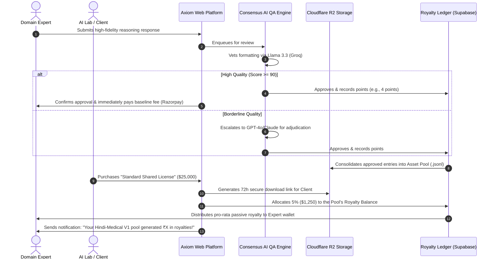

# Outskill × OpenAI AI Builders Hackathon
## Phase 1 Checkpoint Submission: **Axiom**

This document contains the official Phase 1 deliverables for **Axiom** (formerly Ved), a decentralized, asset-backed dataset platform designed to solve the AI industry's critical high-value training data bottleneck through dataset licensing and perpetual expert royalties.

---

# 1. Product Brief

### 1.1 The Pain Point
Frontier AI labs (OpenAI, Anthropic, Google) are starving for high-quality, verified human reasoning data, particularly in non-Western contexts and complex domains (medicine, law, advanced mathematics, regional multilingual code-mixing). 

Existing solutions (like Scale AI or Vetto) operate as **labor-arbitrage services companies**:
1. They treat experts as gig-workers, leading to high churn, volatile quality, and constant retraining costs.
2. They deliver datasets as custom, one-off work-for-hire, capturing revenue only once.
3. Their quality assurance (QA) scales linearly with headcount, compressing margins.

### 1.2 The Axiom Solution
**Axiom** replaces labor-arbitrage with a **proprietary data-asset platform**. We do not sell annotation hours; we build, own, and license high-value dataset pools repeatedly, sharing a perpetual **5% royalty** with the domain experts who built them.

```
                  THE AXIOM FLYWHEEL
  ┌─────────────────────────────────────────────────┐
  │  Experts Earn Perpetual Royalties (Retained)    │
  └────────────────────────┬────────────────────────┘
                           ▼
  ┌─────────────────────────────────────────────────┐
  │  Unmatched Data Quality & Domain Curation       │
  └────────────────────────┬────────────────────────┘
                           ▼
  ┌─────────────────────────────────────────────────┐
  │  Labs License Asset Pools at Lower Cost         │
  └────────────────────────┬────────────────────────┘
                           ▼
  ┌─────────────────────────────────────────────────┐
  │  Compounding Profits Reinvested into Experts     │
  └─────────────────────────────────────────────────┘
```

### 1.3 Key Features & Capabilities
* **Tiered Asset Pools**: Datasets are structured as thematic "index funds" (e.g., *Axiom-Hinglish-Clinical-V1*). Experts earn "Contribution Points" per approved task, yielding passive royalty dividends every time that pool is licensed.
* **Dual-Licensing Commercial Model**:
  * *Standard Shared License*: Lower entry price ($25K–$50K), non-exclusive, ready for download via Cloudflare R2.
  * *Exclusive Buyout License*: Premium pricing (3x-4x), data is archived and removed from the marketplace to ensure competitive advantage.
* **Consensus-Driven AI QA**: Multi-model vetting pipeline. High-speed, low-cost models (Llama 3.3 via Groq) provide instant structural and linguistic review. Borderline cases are escalated to premium models (Claude 3.5 Sonnet / GPT-4o) or human domain leads, reducing QA overhead by up to 50%.
* **Direct OpenAI Fine-Tuning Integration**: Axiom co-optimizes dataset formats and lets clients trigger model fine-tuning directly via the OpenAI Fine-Tuning API in a single click.

---

# 2. One-Pager Investor Pitch

**Company Name**: Axiom  
**Elevator Pitch**: *Axiom is a high-margin data-asset platform that builds, owns, and repeatedly licenses premium domain-expert datasets for frontier AI models, locking in top global experts through a perpetual royalty ledger.*

### 2.1 The Market Opportunity
As AI models reach the limits of raw web scrapability, the focus has shifted entirely to post-training (RLHF, instruction tuning). The market for high-quality human data is projected to exceed **$10B by 2028**. Currently, no platform offers a repeatable asset-resale model combined with an expert-retention royalty engine.

### 2.2 The Business Model
Axiom operates as a **Data B2B SaaS + Marketplace**:
* **The Leverage**: We produce a high-value dataset once for $100K (50% funded by a pilot client). We resell standard licenses to 5+ subsequent clients at $25K each.
* **Marginal Cost of Resale**: Near zero.
* **Net Margins**: **35% - 70%** (vs. Vetto's service-squeezed 15% margins).
* **The Moat**: Churn is too expensive for our experts. Leaving Axiom means walking away from compounding quarterly royalties.

### 2.3 The Traction & Growth Strategy
* **Targeting Hackathon Submission**: Launching Phase 1 prototype of the Expert Royalty Workbench and Client Licensing Portal.
* **Phase 2 (Months 1-3)**: Onboard 200 credentialed Indian physicians and bilingual legal experts. Create the first three Indic/Code-Mixed Asset Pools.
* **Phase 3 (Months 3-6)**: Bid for national IndiaAI Mission evaluation and safety benchmarking initiatives.

---

# 3. User Flow Diagram

The diagram below details the end-to-end user lifecycle from expert contribution to client licensing and automated royalty distribution.



---

# 4. MVP Screenshots & Mockups

Below are the high-fidelity UI designs representing the first fully functional screens of the Axiom platform.

### 4.1 Screen A: The Expert Royalty Workbench
Shows active task pools, validation metrics, and most importantly, the active passive-income royalty ledger.


### 4.2 Screen B: The Client Licensing Portal
The dual-licensing checkout page showing standard vs. exclusive buyout licenses, with direct Cloudflare R2 download tokens.


---

### Technical Credibility (OpenAI Hackathon Alignment)
* **API Integrations**: Built on Next.js 14, tRPC, BullMQ for distributed job queues, Supabase DB, and Cloudflare R2.
* **LLM Engine**: Combines OpenAI GPT-4o for complex reasoning QA adjudication, with fast open-source models for structure validation.
* **OpenAI Fine-Tuning Integration**: The dataset delivery includes a direct webhook to trigger supervised fine-tuning jobs on OpenAI models (`gpt-4o-mini`, `gpt-4o`) using the licensed data with one click.
