# Ved — The AI Data Monopoly Playbook

> **Vetto is a commodity business dressed as a philosophy company. We're building a monopoly.** This document explains why their model bleeds margin, why ours doesn't, and how dataset ownership, Indic language control, and government lock-in make us the only supplier Western labs can't replace.

---

## Why Vetto's Model Is a Bad Business

Vetto operates a **labor arbitrage play** with a thin philosophical veneer. The economics are brutal and getting worse:

| What Vetto Does | Why It's Fragile |
|----------------|------------------|
| Pays experts $40–$300 per deliverable, bills clients higher | The spread is the entire business. Any competitor — including us — can offer experts more and clients less. Margin compression is inevitable. |
| Experts are gig workers with zero loyalty | Churn is structurally high. Every expert you train leaves the moment someone offers $5 more. You're running a training program for your competitors. |
| Sells raw annotation as a service | Client pays for labor hours. When the project ends, revenue stops. No recurring revenue. No IP ownership. No resale. Pure services cash flow. |
| QA is a cost center (human reviewers) | QA headcount scales linearly with production. Gross margin erodes as you grow. The only way to maintain margin is to squeeze experts — which accelerates churn. |
| No data ownership | Vetto produces datasets for clients, then the client owns the dataset. Vetto can't resell it. Every dollar of revenue is earned once. |
| Brand is philosophy, not infrastructure | "Data is an interface" sounds good in a manifesto. It doesn't ship product. There's no proprietary tech, no API, no platform — just a services company with good copywriting. |

**The inevitable outcome**: Vetto gets squeezed from above (clients demand lower prices) and below (experts demand higher pay). Their moat is "we know Rodrigo Schmidt and he used to work at Meta." That's not a moat. That's a Rolodex.

### Our Model: Same Market, Completely Different Economics

We don't sell annotation labor. We build and own datasets. This changes everything.

| What We Do | Why It's Defensible |
|-------------|---------------------|
| **Produce proprietary datasets that we own** | Dataset is an asset. Resell it to 5 clients. Revenue from the same work gets 5x leverage. Vetto earns once. We earn in perpetuity. |
| **Experts get perpetual royalties, not one-time pay** | They're incentivized to stay, maintain quality, and recruit peers. Churn is expensive for them. Loyalty is a moat for us. |
| **AI-assisted QA reduces human QA cost 30-50%** | Margin improves with scale, not degrades. The QA model gets better with more data — a compounding advantage. |
| **Indic language data monopoly** | Nobody else can annotate Hindi, Bengali, Tamil, Telugu at scale with domain experts. Clients have exactly one supplier if they need this. That's pricing power. |
| **Government contracts create switching costs** | Once a government agency builds AI infrastructure on your datasets and benchmarks, switching vendors requires re-bidding, re-certification, and political buy-in. They're not leaving. |
| **Fine-tuning as a service captures more of the value chain** | A dataset might be $50K. The same project with fine-tuning included is $200K+. The client can't unbundle it because dataset and training pipeline are co-optimized. |
| **Platform SaaS creates recurring revenue** | Self-serve project creation, QA API, dataset marketplace, fine-tuning API. This is where the valuation multiple comes from. |

### The Structural Moat That Kills Competition

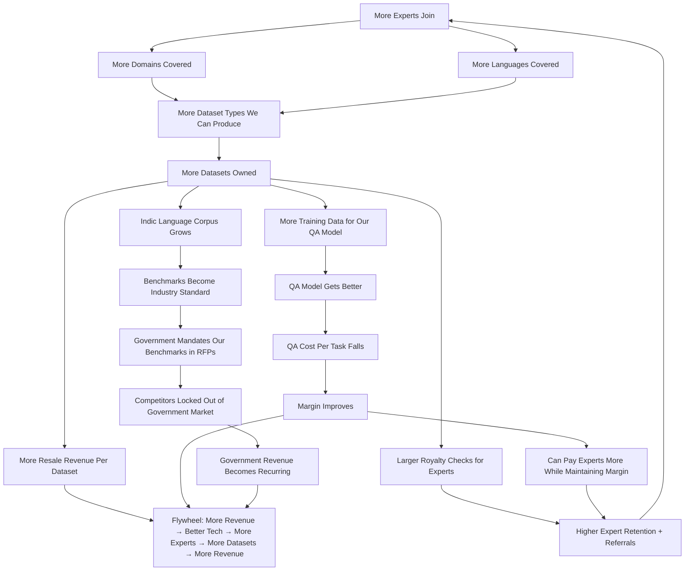

### The Direct P&L Comparison

```
VETTO'S P&L (per $100K project):
  Client pays:                          $100,000
  Expert payouts ($50/task avg):        -$35,000  (35%)
  Human QA team:                        -$15,000  (15%)
  Platform/ops:                         -$20,000  (20%)
  Sales/overhead:                       -$15,000  (15%)
  ─────────────────────────────────────────────
  Gross profit:                          $15,000  (15% margin)

  Asset created:                        $0 (client owns)
  Recurring revenue:                    $0
  Resale potential:                     $0


OUR P&L (per $100K project):
  Client pays:                          $100,000
  Expert immediate pay:                 -$50,000  (50% — higher because royalty buys loyalty)
  Expert perpetual royalty (5%):         -$5,000  (5% — paid from licensing, not project margin)
  AI QA (automated, marginal cost):      -$3,000  (3%)
  Platform/ops:                         -$12,000  (12%)
  ─────────────────────────────────────────────
  Gross profit:                          $35,000  (35% margin — 2.3x Vetto's)

  Asset created:                        OWNED DATASET
  Resale revenue (5 licenses × $25K):   +$125,000 (125% additional, near-zero marginal cost)
  Expert royalty on resale (5%):         -$6,250
  ─────────────────────────────────────────────
  Total revenue on one dataset:         $225,000
  Total expert payout:                   $61,250 (experts earn more lifetime, we earn more lifetime)

  Recurring revenue streams (year 3+):
    Dataset marketplace licensing:       $15-50K/yr per dataset × 25 datasets
    QA API:                              Usage-based, high margin
    Government maintenance:              Annual retainers for benchmark updates
    FTaaS:                              $50-200K per job, 40-50% margin
```

Vetto makes 15% margin on services and creates zero assets. We make 35% margin on services plus 125%+ on resale, and build compounding assets. Their experts churn because they're gig workers. Our experts stay because leaving means abandoning their royalty stream. That's not ethics. That's incentive design.

---

## Table of Contents

1. [Phase 0: Foundation](#phase-0-foundation)
2. [Phase 1: Supply-Side — The Expert Retention Machine](#phase-1-supply-side)
3. [Phase 2: Revenue — Client Lock-In Through Dataset Ownership](#phase-2-revenue)
4. [Phase 3: The Moats — AI QA Cost Reduction + Indic Language Monopoly](#phase-3-the-moats)
5. [Phase 4: Scale — Government Lock-In, FTaaS, and SaaS Platform](#phase-4-scale)
6. [Appendix A: API Specification](#appendix-a-api-specification)
7. [Appendix B: Infrastructure & Deployment](#appendix-b-infrastructure--deployment)

---

## Phase 0: Foundation

### 0.1 System Architecture (C4 — Context Level)

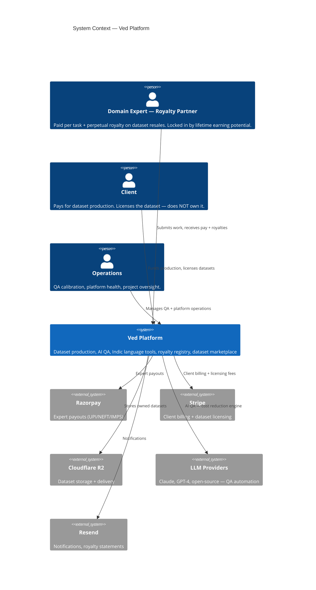

### 0.2 System Architecture (C4 — Container Level)

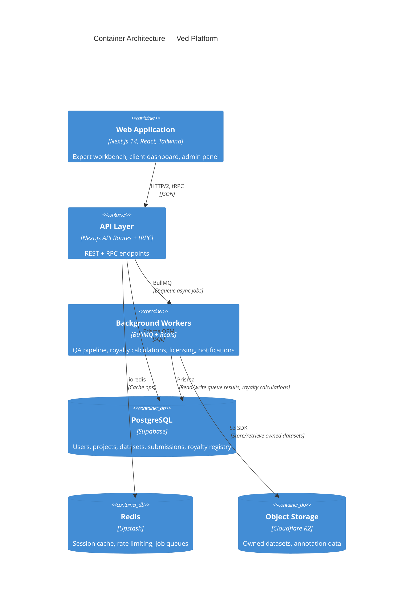

### 0.3 Technology Stack

| Layer | Technology | Rationale |
|-------|-----------|-----------|
| **Frontend** | Next.js 14 (App Router) + TypeScript | SSR for SEO, ISR for dataset marketplace, RSC for performance |
| **Styling** | Tailwind CSS + shadcn/ui | Fast, accessible components |
| **State Management** | React Query (TanStack) + Zustand | Server state vs. client state |
| **API** | tRPC (internal) + REST (public) | Type-safe internal, standard REST for licensing API |
| **ORM** | Prisma | Type-safe migrations, audit trails |
| **Database** | PostgreSQL 16 (Supabase) | RLS, real-time subscriptions for dashboards |
| **Cache & Queue** | Redis (Upstash) + BullMQ | Job queues, caching |
| **Auth** | NextAuth.js v5 | Email magic link + Google OAuth + SMS OTP |
| **Payments** | Razorpay (experts) + Stripe (clients/licensing) | UPI/NEFT/IMPS for India; Stripe for international |
| **Email** | Resend | React email templates |
| **Storage** | Cloudflare R2 | S3-compatible, zero egress (saves $60K+/year on dataset delivery) |
| **AI/ML** | Claude 3.5 Sonnet + GPT-4o + Groq (Llama) | QA review only — experts create, AI reviews |
| **Monitoring** | Sentry + BetterStack + PostHog | Full observability |
| **Hosting** | Vercel (web) + Railway (workers) | Serverless for frontend, persistent for workers |
| **CI/CD** | GitHub Actions | Lint → Type-check → Test → Deploy |

### 0.4 Incentive Architecture

The only thing that matters in a two-sided marketplace: **retention**. Experts must have a financial reason to stay. Clients must have a switching cost.

**For experts — the royalty flywheel**:
- Immediate pay per approved task (competitive with market)
- Perpetual 5% royalty on any dataset they contribute to — for life
- Royalty compounds: contribute to 10 datasets, earn from 10 royalty streams
- Leaving the platform means abandoning future royalty earnings
- Referring another expert = 1% of their lifetime earnings
- Net effect: churn is expensive for the expert, so they don't churn

**For clients — the switching cost ladder**:
- Dataset licensing is cheaper than commissioning new annotation ($25K vs $100K)
- Once they've integrated our dataset format, switching costs time + engineering
- Government clients: re-bidding a contract is a 6-12 month process
- Fine-tuning customers: dataset + training pipeline are co-optimized. Unbundling is expensive.
- Net effect: clients stay because leaving costs more than staying

**For us — the monopoly position**:
- Own the dataset → resell infinitely at near-zero marginal cost
- Indic language barrier → no Western competitor can supply this data
- Government certification → competitors need 12-18 months to qualify for bids
- AI QA model improves with more data → compounding cost advantage
- Expert network grows → more domains + languages → more datasets → more licensing → more royalties → more experts

### 0.5 Dataset Ownership — Legal Structure

We own every dataset produced on the platform. Expert contributions are work-for-hire with a perpetual royalty attached. Clients license datasets; they do not own them.

**Expert Agreement**: "All work submitted through the Platform is owned exclusively by Ved. Expert receives payment per approved task plus a perpetual 5% royalty on gross licensing revenue from any dataset containing their contributions."

**Client License**: "Client receives a perpetual, non-exclusive, non-transferable license for AI training and evaluation. Dataset ownership remains with Ved. Client may not resell, sublicense, or redistribute."

**Resale Rights**: Ved may license the same dataset to unlimited additional clients. Expert royalty applies to all licensing revenue.

**Government Exception**: Government-funded datasets may grant unlimited government usage rights, but Ved retains commercial rights to resell to private clients (negotiable per contract).

### 0.6 Licensing Restrictions — Revenue Protection

Three strategic restrictions. These are standard enterprise data licensing terms — identical to what Bloomberg, LexisNexis, and every proprietary data company uses:

| Restriction | Business Reason |
|-------------|-----------------|
| No resale or sublicensing | Clients reselling our data undercuts our marketplace. Every license is direct from us. |
| No competing annotation platforms | Prevents a client from training better annotators using our data and launching a competitor. Standard non-compete. |
| No public release | Open-sourcing destroys resale value. Standard B2B terms. |

### 0.7 Database Schema (Prisma)

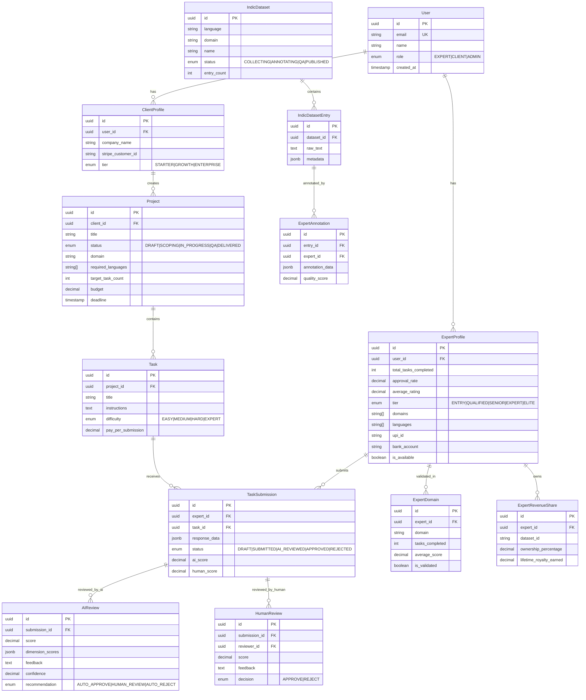

### 0.8 Key Schema Decisions

- **ExpertDomain as junction table**: Domain-specific scoring. An expert can be ELITE in MEDICAL but ENTRY in CODING.
- **ExpertRevenueShare**: Core retention mechanism. Tracks ownership % per dataset plus accumulated lifetime royalty earnings.
- **AIReview before HumanReview**: AI runs first-pass. Human only sees borderline. This is the 30-50% QA cost reduction engine.

---

## Phase 1: Supply-Side — The Expert Retention Machine

### 1.0 Strategy: Pay Competitively, Lock In Through Royalties

Market rate for domain expert annotation in India: ₹500-₹3,000 per task. We pay ₹750-₹4,500 depending on complexity — plus the perpetual 5% royalty.

The royalty is the cheapest retention tool in existence. Paying ₹500 more per task to reduce churn doesn't work — someone will always offer ₹600 more. But a royalty stream that compounds across datasets over years? That creates a switching cost measured in lakhs. No competitor can match it without adopting our dataset ownership model.

### 1.1 Expert Onboarding

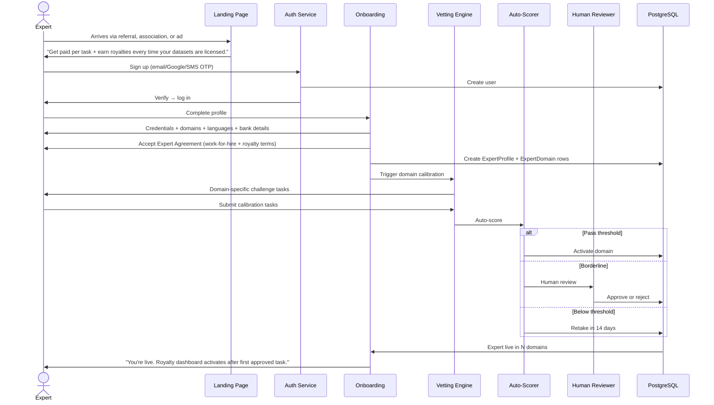

### 1.2 Vetting Engine

| Domain | Task Type | Method |
|--------|-----------|--------|
| Medical | Diagnosis MCQ + Case summary | MCQ auto, summary via LLM |
| Legal | Statute application + Research brief | Statutory accuracy (auto), reasoning (LLM) |
| Coding | Bug fix + Code review | Test cases + static analysis |
| Finance | Analysis + Valuation | Calculations (auto), methodology (LLM) |
| STEM | Problem set + Research summary | Exact answers + rubric |
| Indic Language | Translation + Grammar QA | BLEU/COMET + native reviewer calibration |
| Reasoning | Logic + Proof | Deterministic correctness |

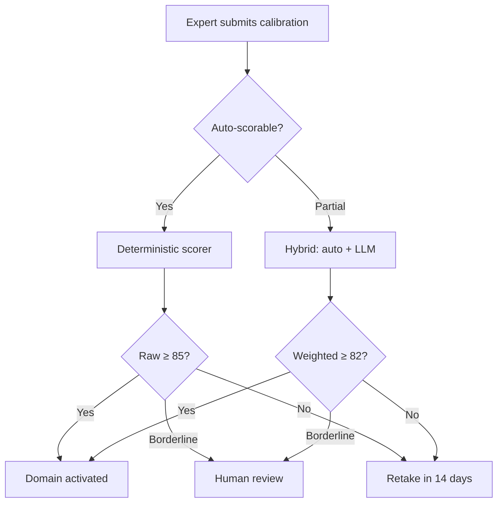

### 1.3 Tier System

```typescript
const TIERS = {
  ENTRY:     { tasks: 0,    rate: 0,    domains: 0, months: 0 },
  QUALIFIED: { tasks: 50,   rate: 0.85, domains: 1, months: 1 },
  SENIOR:    { tasks: 200,  rate: 0.92, domains: 1, months: 3 },
  EXPERT:    { tasks: 500,  rate: 0.95, domains: 2, months: 6 },
  ELITE:     { tasks: 1000, rate: 0.97, domains: 3, months: 12 },
};
```

Higher tiers unlock: EXPERT-difficulty tasks, lead domain expert status (8% royalty instead of 5%), priority matching, daily payouts.

### 1.4 Payment & Royalty System

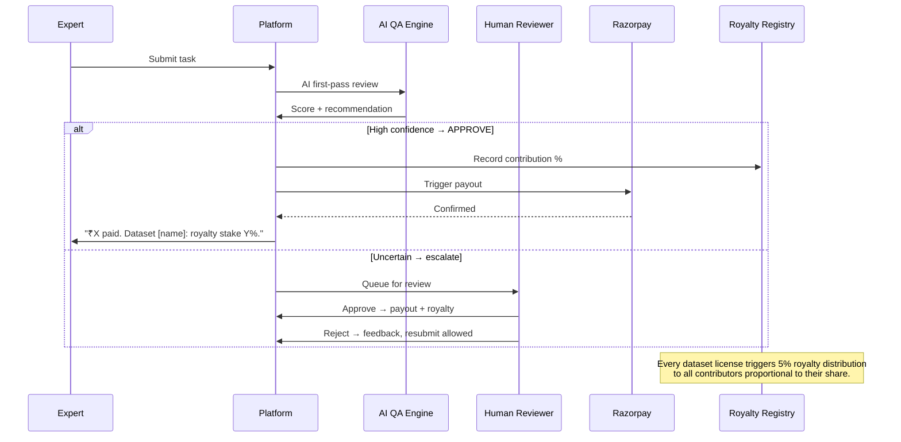

**Task pay rates (India-adjusted)**:

| Difficulty | Pay (₹) | Est. Time | Effective Rate |
|-----------|---------|-----------|----------------|
| Easy | ₹500-750 | 15-30 min | ₹1,000-3,000/hr |
| Medium | ₹1,000-2,000 | 30-60 min | ₹1,000-4,000/hr |
| Hard | ₹2,000-4,500 | 60-120 min | ₹1,000-4,500/hr |
| Expert | ₹4,500-8,000 | 90-180 min | ₹1,500-5,300/hr |

For a physician earning ₹2-3 lakh/month (₹1,000-1,500/hr), our median ₹1,500 for 60-min work is competitive. The royalty creates the long-term upside.

### 1.5 Referral System

```mermaid
flowchart LR
    A[Expert shares link] --> B[Colleague signs up]
    B --> C[Passes vetting]
    C --> D[Completes 10 tasks]
    D --> E[Referrer earns 1% of referee's lifetime earnings]
    E --> F[Paid monthly]

    Note: 1% lifetime share aligns incentives.<br/>Refer quality people who will contribute for years.
```

- Unique referral code per expert, 90-day attribution window
- Dashboard: "You've referred 8 experts. Their collective lifetime earnings: ₹18,40,000. Your share: ₹18,400 (and growing)."

### 1.6 Task Matching

```mermaid
flowchart TD
    A[Task: domain, difficulty, languages, pay] --> B[Query eligible experts]

    B --> C1[Domain match]
    C1 --> C2[Tier gate: EXPERT diff → EXPERT+; HARD → SENIOR+]
    C2 --> C3[Language match]
    C3 --> C4[Under weekly capacity]
    C4 --> C5[Not already on this task]
    C5 --> C6[No recent quality flags]

    C6 --> D[Score + rank]
    D --> D1[Domain accuracy: 0.40]
    D --> D2[Approval rate (90-day): 0.35]
    D --> D3[Diversity: 0.15]
    D --> D4[Speed bonus: 0.10]

    D1 & D2 & D3 & D4 --> E[Ranked list]
    E --> F[Top N notified]
    F --> G{Accepts?}
    G -->|Yes| H[Task claimed — 48h]
    G -->|No| I[Next batch]
```

---

## Phase 2: Revenue — Client Lock-In Through Dataset Ownership

### 2.0 Strategy: We Own the Data. They License It.

Every client signs a licensing agreement, not a work-for-hire contract. They fund dataset production. They get a license to use the data for AI training. We keep the asset and resell it indefinitely.

A $100K project produces an asset we can license to 5 clients at $25K each. Marginal cost: near zero. Vetto earns $100K on the same scope and creates nothing.

### 2.1 Client Lifecycle

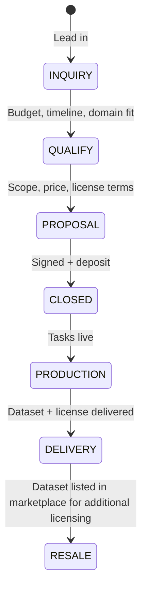

### 2.2 Client Sales Cycle

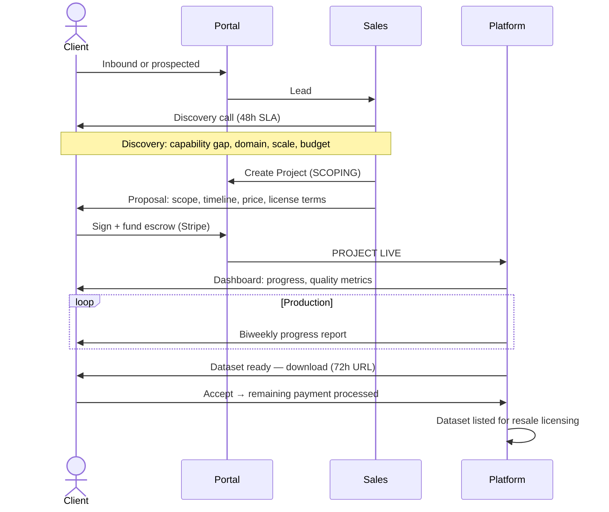

### 2.3 Pricing

| Tier | Price | Scope | Client |
|------|-------|-------|--------|
| Starter | $5K–$25K | Single domain, ≤500 tasks, AI QA, CSV/JSON | Indian enterprise, academic |
| Growth | $25K–$100K | Multi-domain, ≤5,000 tasks, AI+human QA, custom rubrics | Mid-tier AI lab, serious enterprise |
| Enterprise | $100K–$500K+ | Unlimited, dedicated lead, FTaaS option, custom formats | Frontier labs, government |

Payment: 50% upfront, 50% on delivery. Enterprise: milestone-based.

### 2.4 Client Pipeline

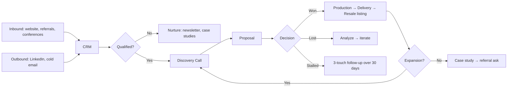

Sources by close rate: warm intros 30-40%, conferences 10-15%, inbound 5-8%, cold 2-4%, government RFP 5-15%.

---

## Phase 3: The Moats — AI QA Cost Reduction + Indic Language Monopoly

### 3.0 Two Compounding Advantages

**Advantage 1: AI QA that improves with every submission.** Every expert submission trains our QA model. More submissions → better QA → lower human review cost → higher margin → pay experts more → more experts join → more submissions. Vetto's QA is a linear cost center. Ours is a compounding cost reducer.

**Advantage 2: Indic language monopoly.** No Western company can annotate Hindi, Bengali, Tamil, Telugu at scale with credentialed domain experts. The supply doesn't exist outside India. Clients who need Indic data have one supplier. That's pricing power.

### 3.1 AI QA Pipeline

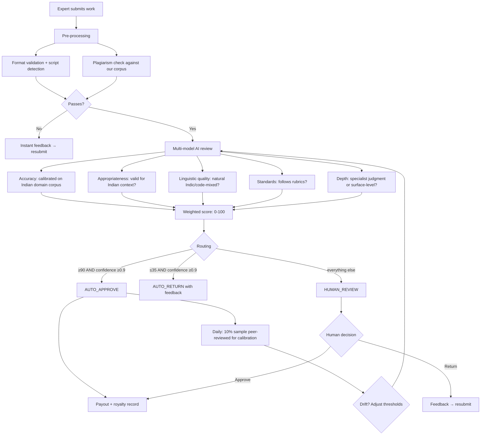

**AI Review Prompt (Medical, abbreviated)**:

```
You are an AI reviewer calibrated on Indian medical knowledge.

Evaluate the submission across 5 dimensions (1-5 each):
1. DOMAIN ACCURACY — per ICMR, AIIMS, MCI standards
2. CULTURAL APPROPRIATENESS — valid for Indian patients? Accounts for prevalent conditions?
3. LINGUISTIC AUTHENTICITY — natural in target language/script?
4. STANDARDS — follows rubric and style guide?
5. EXPERT DEPTH — specialist judgment or generic knowledge?

Output: JSON with scores, justification, flags, confidence, recommendation.
```

**Calibration Corpus**: ICMR guidelines, AIIMS publications, Supreme Court judgments (Indian Kanoon), RBI circulars, NCERT textbooks, state board syllabi, Indic-language journalism, code-mixed social media, and expert correction data from our platform.

### 3.2 Indic Language Infrastructure

This is a structural barrier to entry. No Western company can replicate it.

| Barrier | Why |
|---------|-----|
| Native annotators at scale | India has 100K+ medical graduates/year. No other country has this density of English+Indic bilingual domain experts. |
| Code-mixed understanding | Hinglish/Tanglish has no formal grammar. You need native intuition, not guidelines. |
| Domain + language intersection | A Tamil-speaking tax lawyer who knows both the Income Tax Act and Tamil legal terminology is not on Upwork. |
| Script rendering | Most annotation tools break on Devanagari conjuncts, Tamil pulli marks, Bengali hasanta. We build for these first. |
| Trust | Indian professionals don't trust Western platforms. We operate under Indian legal jurisdiction with local payment rails. |

**Priority languages**: Tier 1 — Hindi, Bengali, Telugu, Tamil. Tier 2 — Marathi, Gujarati, Kannada, Malayalam, Punjabi. Tier 3 — demand-driven.

**Annotation workbench**: Script detection, correct conjunct rendering, script-specific Hunspell dictionaries, transliteration toggle, script-aware spellcheck, code-mixed QA calibration.

**Code-mixed data** is the highest-value, hardest-to-replicate asset. Most Indians use mixed Hindi-English (Hinglish) or Tamil-English (Tanglish) in daily communication. Models trained on monolingual corpora fail on real Indian input. This is a pricing moat: no other supplier has this data at scale.

---

## Phase 4: Scale — Government Lock-In, FTaaS, SaaS Platform

### 4.0 Government: Ultimate Switching Cost

Government contracts are hard to win, impossible to lose. Once an agency builds AI infrastructure on your data and benchmarks, switching requires re-bidding, re-certification, and political buy-in — 12-18 months. They're not leaving.

India is spending $1.2B on IndiaAI Mission + Bhashini + DIKSHA + state-level AI missions. This is our highest-value, highest-barrier pipeline.

### 4.1 Government Engagement

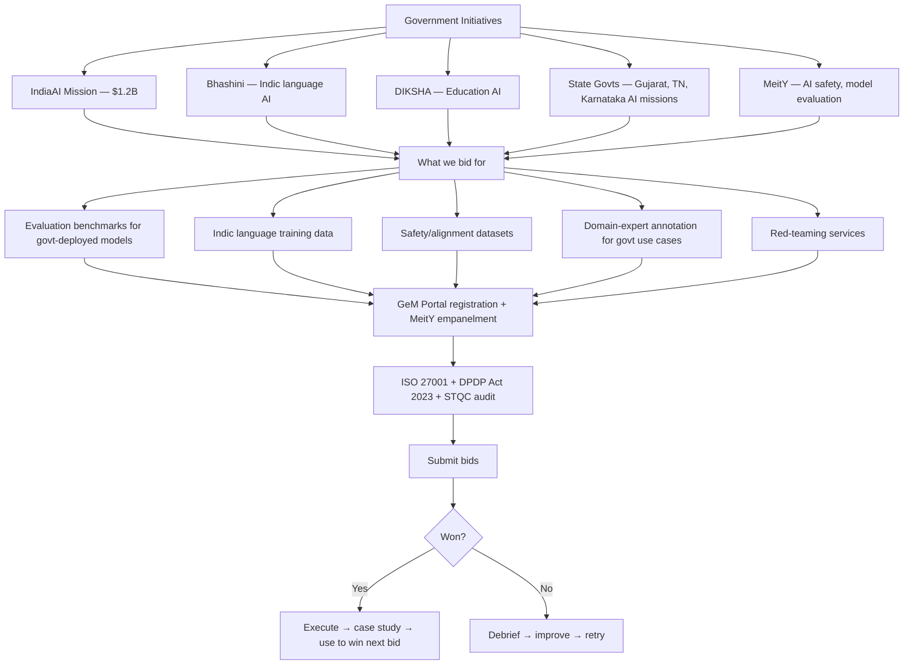

**Strategy**: Win 2-3 state government projects first. Use those as case studies to bid for IndiaAI Mission. Government logo = instant credibility for private clients.

### 4.2 Fine-Tuning as a Service (FTaaS)

Capture more value: don't sell just the dataset. Sell the fine-tuned model.

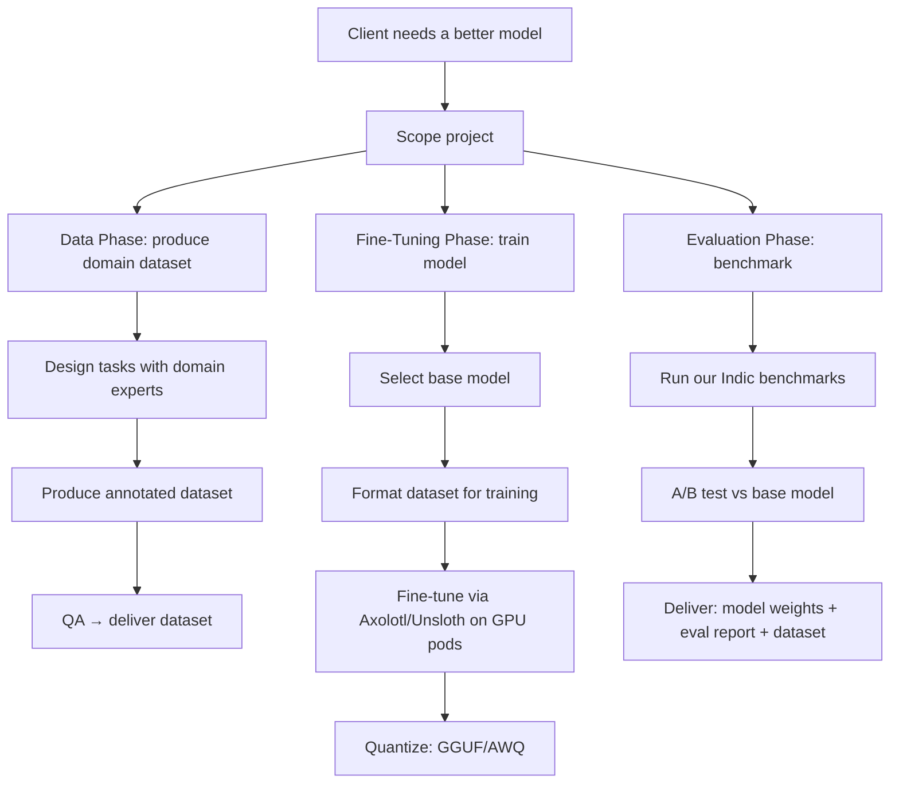

**GPU options**: RunPod A100 ($1.89/hr) for 7-13B models, H100 ($2.99/hr) for larger. Indian cloud providers for government projects.

Dataset might be $50K. Adding FTaaS: $200K+. And the client can't unbundle it — dataset and training pipeline are co-optimized.

### 4.3 SaaS Platform (Phase 4+)

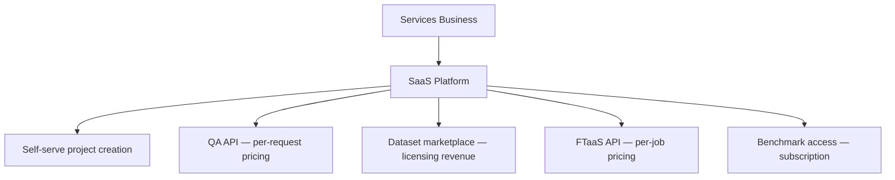

This is where the valuation multiple lives. Services companies trade at 3-5x revenue. Data platforms with recurring revenue trade at 10-20x.

### 4.4 Financial Model (Illustrative)

| Metric | Year 1 | Year 2 | Year 3 |
|--------|--------|--------|--------|
| Active experts | 200 | 1,500 | 5,000 |
| Projects delivered | 12 | 45 | 120 |
| Avg. project value | $18K | $45K | $85K |
| Project revenue | $216K | $2.0M | $10.2M |
| Dataset licensing | $10K | $120K | $600K |
| Government contracts | $0 | $200K | $1.5M |
| FTaaS revenue | $0 | $80K | $800K |
| **Total revenue** | **$226K** | **$2.4M** | **$13.1M** |
| Expert payouts | $113K | $1.2M | $6.5M |
| Platform ops | $34K | $360K | $2.0M |
| AI/Infra cost | $15K | $80K | $400K |
| **Net** | **~$64K** | **~$760K** | **~$4.2M** |

Expert payout includes task pay + royalties. As licensing revenue grows, expert payout as % of total actually decreases (task pay is the largest component; licensing has near-zero marginal cost).

### 4.5 Team Scaling

| Phase | Timeline | Headcount | Key Hires |
|-------|----------|-----------|-----------|
| Phase 0 | Months 1-2 | 2-3 | Founder, Full-stack eng, Ops |
| Phase 1 | Months 3-6 | 5-8 | +2 Eng (frontend + AI/ML), +Recruiter, +QA lead |
| Phase 2 | Months 7-12 | 12-18 | +Sales lead, +2 AE (India + US), +ML Eng, +Designer |
| Phase 3 | Year 2 | 25-40 | +Govt relations, +Indic language PM, +3 language leads, +DevOps |
| Phase 4 | Year 3+ | 50-100 | SaaS team, regional sales, research, compliance |

---

## Appendix A: API Specification

### A.1 Expert Endpoints

```
POST   /api/experts/register           — Register + profile
GET    /api/experts/me                  — Profile, contribution stats, royalty registry
PATCH  /api/experts/me                  — Update profile, availability, bank details
GET    /api/experts/me/domains          — Validated + pending domains
POST   /api/experts/me/vetting          — Start domain calibration
POST   /api/experts/me/vetting/:id      — Submit calibration response
GET    /api/experts/me/opportunities    — Available work
GET    /api/experts/me/opportunities/:id — Task detail + pay
POST   /api/experts/me/opportunities/:id/claim — Claim task
POST   /api/experts/me/tasks/:id/submit — Submit work
GET    /api/experts/me/submissions      — History with feedback
GET    /api/experts/me/royalties        — Dataset ownership %, lifetime earnings
GET    /api/experts/me/payouts          — Payment history
GET    /api/experts/me/referrals        — Referral stats + earnings
```

### A.2 Client Endpoints

```
POST   /api/clients/inquire             — Submit inquiry
GET    /api/clients/me/projects         — Active + past projects
GET    /api/clients/me/projects/:id     — Project detail + aggregate metrics
POST   /api/clients/me/projects/:id/feedback — Feedback on dataset
GET    /api/clients/me/projects/:id/export   — Download dataset (72h URL)
GET    /api/clients/me/invoices         — Billing history
```

### A.3 Admin Endpoints

```
GET    /api/admin/dashboard             — Aggregate metrics
GET    /api/admin/experts               — Expert directory
POST   /api/admin/experts/:id/tier      — Adjust tier
GET    /api/admin/projects              — All projects
POST   /api/admin/projects/:id/status   — Transition status
GET    /api/admin/reviews/queue         — Pending QA reviews
POST   /api/admin/reviews/:id           — Submit review
GET    /api/admin/analytics/qa-model    — AI QA drift detection
```

### A.4 Public/Licensing API

```
GET    /api/v1/datasets                 — Published datasets for licensing
GET    /api/v1/datasets/:id             — Dataset detail + sample
POST   /api/v1/datasets/:id/license     — Purchase license
POST   /api/v1/qa/review                — Submit for AI review (API key, rate-limited)
GET    /api/v1/qa/review/:id            — Review result
POST   /api/v1/finetune                 — Submit FTaaS job
GET    /api/v1/finetune/:id             — Job status
GET    /api/v1/benchmarks               — Public evaluation benchmarks
GET    /api/v1/benchmarks/:id/leaderboard — Model performance
```

---

## Appendix B: Infrastructure & Deployment

### B.1 Deployment Architecture

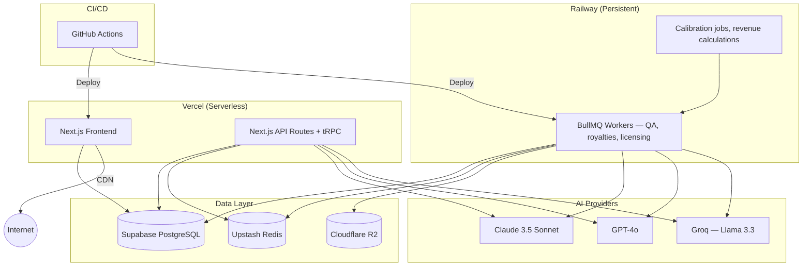

### B.2 Infrastructure Decisions

- **Vercel + Railway**: Vercel for Next.js (best DX), Railway for persistent workers (BullMQ needs long-lived processes)
- **Cloudflare R2**: Zero egress fees. Delivering 100GB datasets to clients saves $60K+/year vs S3.
- **BullMQ over SQS**: Simpler, no AWS lock-in, works with Redis we already have.

### B.3 Monitoring

| Signal | Tool | Alert |
|--------|------|-------|
| API error rate > 1% | Sentry | PagerDuty |
| P95 latency > 2s | BetterStack | Slack |
| AI QA auto-approval deviation >10% | Custom check | Slack + email |
| Payout failure > 3% | Razorpay webhook | Slack + email |
| Expert churn >5% SILVER+ inactive >14 days | PostHog | Weekly review |
| Queue backlog >500 jobs | BullMQ dashboard | Slack |
| DB connections >80% | Supabase | Slack |

### B.4 Security

- Input sanitization (DOMPurify + Zod)
- CSRF protection (Next.js + SameSite cookies)
- Rate limiting (Upstash Redis: 5/min per IP)
- Row-level security on Supabase
- Single-use pre-signed URLs for dataset downloads (72h expiry)
- API keys hashed (SHA-256)
- Webhook signatures verified (Razorpay, Stripe)
- PII encrypted at rest
- DPDP Act 2023 compliance
- ISO 27001 readiness

### B.5 CI/CD

```yaml
name: CI
on:
  pull_request:
    branches: [main]
  push:
    branches: [main]

jobs:
  validate:
    runs-on: ubuntu-latest
    steps:
      - uses: actions/checkout@v4
      - uses: actions/setup-node@v4
        with: { node-version: '20', cache: 'pnpm' }
      - run: pnpm install --frozen-lockfile
      - run: pnpm lint
      - run: pnpm type-check
      - run: pnpm test -- --coverage
      - run: pnpm build

  deploy-preview:
    if: github.event_name == 'pull_request'
    needs: validate
    steps:
      - uses: actions/checkout@v4
      - uses: vercel/vercel-action@v4
        with:
          vercel-token: ${{ secrets.VERCEL_TOKEN }}
          vercel-project-id: ${{ secrets.VERCEL_PROJECT_ID }}

  deploy-production:
    if: github.event_name == 'push' && github.ref == 'refs/heads/main'
    needs: validate
    steps:
      - uses: actions/checkout@v4
      - uses: vercel/vercel-action@v4
        with:
          vercel-token: ${{ secrets.VERCEL_TOKEN }}
          vercel-project-id: ${{ secrets.VERCEL_PROJECT_ID }}
          vercel-args: '--prod'
```

---

## Implementation Roadmap

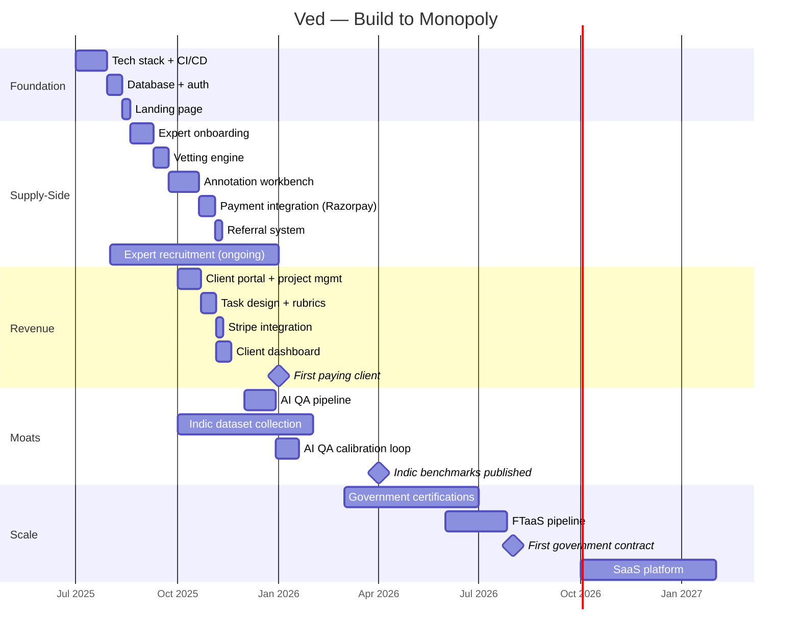

---

## Quick Reference: Critical Path

```
Weeks 1-4:    Stack → Auth → Landing page
Weeks 5-7:    Expert onboarding → first experts signing up
Weeks 8-9:    Vetting engine → first experts validated
Weeks 10-13:  Annotation workbench → first tasks completed
Weeks 14-15:  Razorpay → first expert payouts
Weeks 16-20:  Client portal → first paying client
Month 5:      AI QA pipeline live → QA costs dropping
Month 6:      Indic dataset production → Tier 1 languages
Month 9:      First Indic benchmarks published
Month 12:     Government certifications → first bids
Month 14:     FTaaS pipeline → higher-value deals
Month 18:     First government contract
Year 2:       SaaS platform launch
```

---

> **Vetto is a 15% margin services business with no assets and no recurring revenue. We're a 35%+ margin platform business that owns every dataset, licenses it repeatedly, and compounds margin through AI automation. Same market. Completely different economics.**
>
> The question isn't "can we compete with Vetto on price?" We can — and we can pay experts more, deliver better quality, and be dramatically more profitable. Not because we're more virtuous. Because our business model creates assets: dataset ownership, Indic language monopoly, government lock-in, and compounding AI cost advantages.
>
> Vetto writes manifestos about data being an interface. We just own the data.
